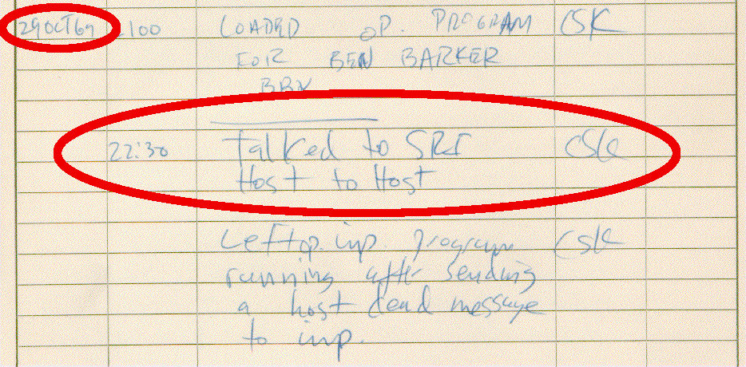
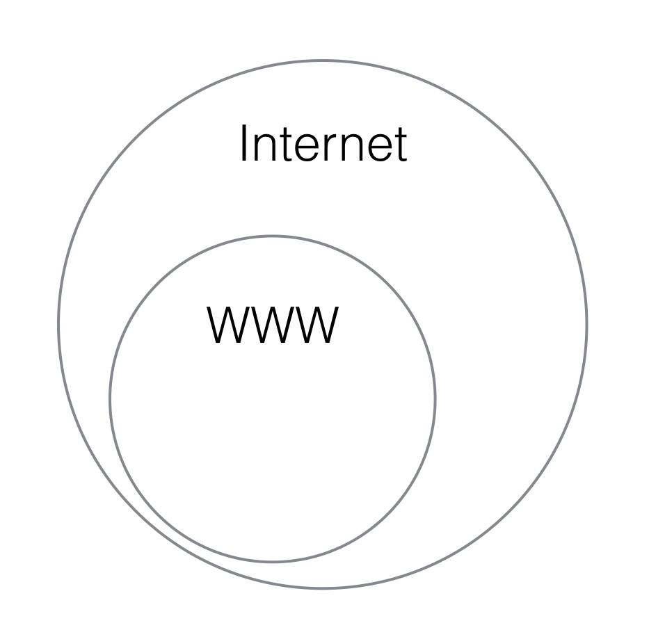
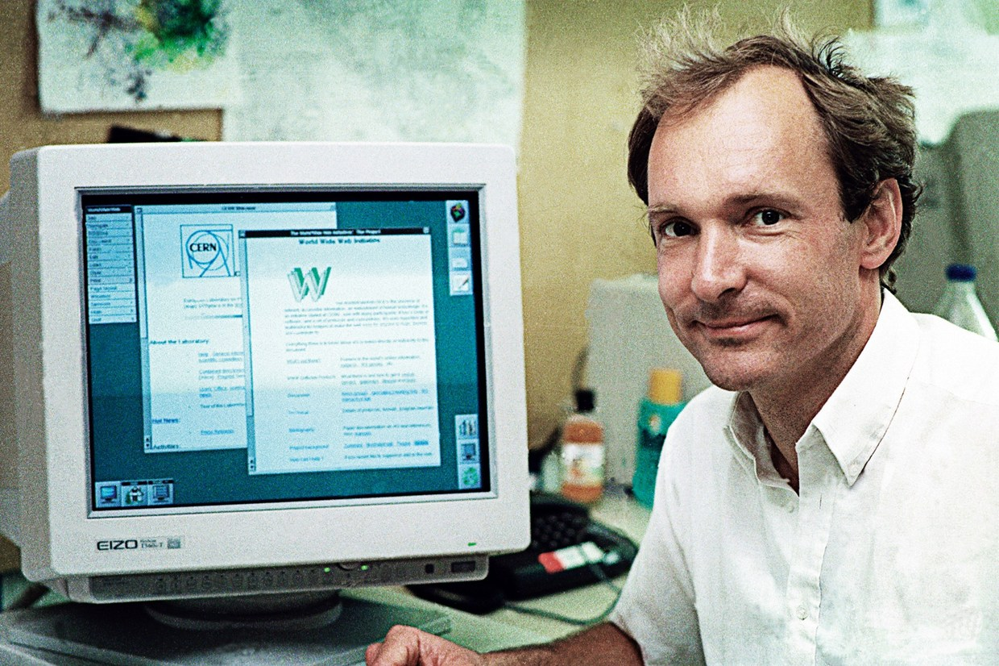
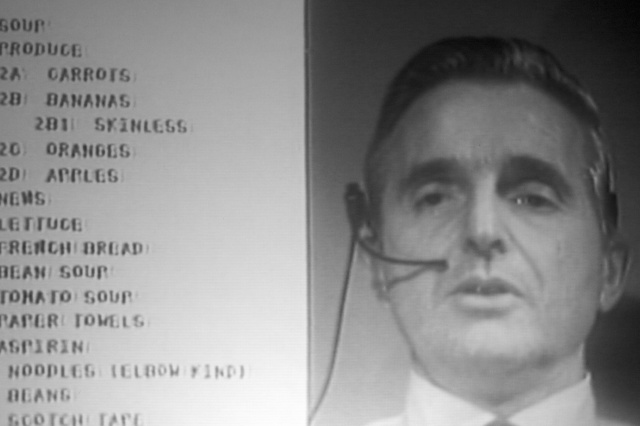
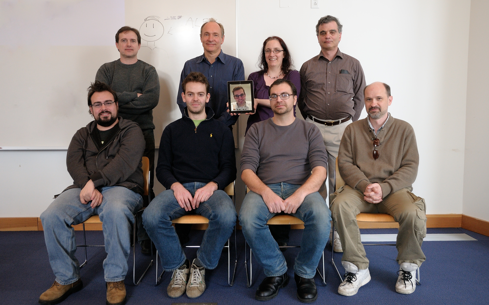

#  Internet Fundamentals


| Timing | Type | Topic |
| --- | --- | --- |
| 5 min | Opening | [Opening](#opening) |
| 15 min | Intro to New Material | [How Does the Internet Work?](#how-does-the-internet-work) |
| 15 min | Intro to New Material | [The Internet Protocol Suite](#the-ip-suite)  |
| 20 min | Guided Practice | [Play the IP and TCP Game](#play-the-ip) |
| 15 min | Intro to New Material | [The RESTful Approach](#restful-approach)  |
| 15 min | Intro to New Material | [The World Wide Web](#the-world-wide-web) |
| 5 min | Conclusion |[Q & A](#conclusion)|


### LEARNING OBJECTIVES
*After this lesson, you will be able to:*

- Understand the purpose of an Internet Protocol (IP) address.
- Break down the components of a URL: protocol, subdomain, domain, extension, and resources.
- Differentiate between the internet and the World Wide Web.
- Identify and describe the most common HTTP request/response headers and the information associated with each.
- Illustrate how data travels through the internet via the response/request cycle.
- Describe the basics of how computers communicate (IP, TCP, HTTP).


---

<a name="opening"></a>
## Opening (5 min)

> Instructor Note: Review the lesson objectives. Describe real-world relevance or a motivating example as to why this lesson is important.


*This workshop is relevant to developers because:*

Just like how it's essential for race car drivers to know how cars operate, when building web applications, it's imperative that web developers have a clear understanding of how the internet functions. Knowledge of the fundamentals will help you explore new concepts in a more complete context.

<a name="how-does-the-internet-work"></a>
## How Does the Internet Work? (15 min)

#### What is the Internet?

* A network of interconnected computers that communicate over a given set of protocols.


#### How Did the Internet Begin?
**The First Internet Communication**



The first internet communication was sent from UCLA to Stanford over a network of computers called the ARPANET.


#### How Do Computers Share Information/Communicate?

1. Shared file systems
2. Shared databases
3. Remote Procedure Calls (RPC) — synchronous
4. Messages — asynchronous

#### How Do Computers do #3 or #4?

* Addresses
* Protocols


<a name="the-ip-suite"></a>
## Internet Protocol and Addresses (15 min)

#### Addresses:

* What is an address?
* What is a street address?
* What is a phone number?
* What is a computer address?
  - IP = 74.125.21.113

```
Dotted-decimal notation:    74     .     125    .     21     .    113
Binary notation:         01001010     01111101     00010101     0111001
Hexadecimal notation:       4A           7D           15           71
```

#### IPv4 and IPv6

* An IPv4 address = 4 bytes = 32 bits = 2^32 unique addresses = 4 billion addresses.
* We now have more than 4 billion computing devices, so we need more bits to address all of them.

#### Enter IPv6

* 16 bytes = 128 bits = 2^128 unique addresses.
* This means we can assign 100 addresses to every atom on the surface of the earth.

#### Static vs. Dynamic IP Addresses

* Servers need static IP addresses.
* Clients can have dynamic IP addresses.

#### What is a URL?

* Uniform Resource Locator
* scheme://domain:port/path?query_string#fragment_id


#### Example:

[http://www.google.com:80/search?q=taylor+swift](http://www.google.com:80/search?q=taylor+swift)

<table>
  <tr>
    <th>PROTOCOL</th>
    <th>HOST (A.K.A., DOMAIN)</th>
    <th>PORT</th>
    <th>PATH</th>
    <th>QUERY PARAMS</th>
  </tr>
  <tr>
    <td>http://</td>
    <td>www.google.com</td>
    <td>:80</td>
    <td>/search</td>
    <td>?q=taylor+swift</td>
  </tr>
</table>


#### LAN vs. WAN

* Local Area Networks

A local area network is composed of computers operating from the same general location. This can mean the same office or building, or a group of nearby buildings. These computers are usually connected by a single cable, a small collection of cables, or a local wifi connection. This set up means that local area networks tend to have fast connection speeds, allowing for quick data transfers.

  - A LAN can have a private set of addresses:
  	- 16-bit LAN addresses: 192.168.0.0
  	- 24-bit LAN addresses: 10.0.0.0

* [Wide Area Network](http://smallbusiness.chron.com/difference-between-lan-wan-wireless-routers-73466.html)

A wide area network covers a much bigger region than a local area network — a town, a country, or the entire world. A WAN tends to use "external" cabling, such as a phone network or a cable company's fiber optic network. Unlike a LAN, a WAN is usually owned and operated by a different organization than the people and organizations that use the network to send and receive data. Usually, a WAN will have slower data transfer speeds than a LAN.

```
$ ping google.com
$ ifconfig | grep inet

PING google.com (74.125.196.101): 56 data bytes
64 bytes from 74.125.196.101: icmp_seq=0 ttl=44 time=15.184 ms
```

Browser URL — http://74.125.196.101/


		http://www.kittengifs.com:80/popular-gifs#results?term=cute&page=2
		|-----|-----------------|---|-----------|--------|----------------|
		   |           |          |       |          |           |
		 protocol    host       port    path     fragment  query-string


#### Ports (Like a Telephone Extension)

Some common default ports:

    FTP:    20
    SSH:    22
    TELNET: 23
    SMTP:   25   Simple Mail Transfer Protocol (email)
    DNS:    53
    HTTP:   80
    POP2:  109   Post Office Protocol (email)
    POP3:  110   Post Office Protocol (email)
    SQL:   118
    IMAP:  220   Internet Message Access Protocol (email)
    LDAP:  389   Lightweight Directory Access Protocol
    SHTTP: 443   Secure HTTP (HTTP over SSL)
    RSH:   514   Remote Shell
    IPP:   631   Internet Printing Protocol

#### Socket: The Combination of an IP Address and a Port

Hint: Think of an IP address as a telephone number and a port as an extension.

Examples:

```
127.0.0.1:3000      port 3000 on the internal loopback address
localhost:3000      port 3000 on the internal loopback address
74.125.196.101:80   port 80 (the HTTP port) at google.com
```

#### Asynchronous Request/Response

* Synchronous: phone conversation
  - Establishes a dedicated connection (circuit switching).

* Asynchronous: email or text message
  - Sends messages back and forth (packet switching).


<a name="play-the-ip"></a>
## The Internet Protocol Suite: Play the IP and TCP Game (20 min)

So, how does data travel through the internet?

Any data you send via the internet is split up into data packets. All packets are routed to their destination eventually but may take different paths to get there.

Let's look at an example.

#### Meet Ivan Pakkitz

Ivan is a postal worker who can travel at the speed of light. He's happy to relay thousands of messages per second between you and a friend. However, he can only transport one message at a time, and each message has to fit on a single index card.

Unfortunately, Ivan is incredibly inattentive, so there are a few limitations to his service:

* **Reliability:** He cannot guarantee that every message will be delivered successfully.
* **Order:**       He cannot guarantee delivered messages will arrive in the same order they were sent.
* **Integrity:**   He cannot guarantee that all messages will arrive in their entirety.
* **Recipient:**   He cannot guarantee that messages will always be delivered to the correct recipient.

For our lab, we will assume that Ivan:


* Shuffles the cards before delivering them
* Sometimes drops a card on the floor (maybe 1 out of 10 cards)
* May rip the card in half before delivering it (maybe 1 out of 20 cards)
* May deliver the card to the wrong person (maybe 1 out of 20)

#### Meet Debbie N. Smith

* Our next character is Debbie N. Smith.
* She knows every person's numeric address.

Let's look at an example:

"I know your name but need to look up your phone number."

    becomes

"I know your DNS name (google.com) but need to look up your IP address."

Domain Name Service (DNS) is in charge of mapping domains to IP adresses.

Example: `mail.google.com`

```
mail = subdomain
google = 2nd level domain
com = top level domain
```


#### Circuit vs. Packet Switching

* Circuit switching
  - Think of it as making a phone call.
  - What does it mean to get a "fast busy" signal?

* Packet switching
  - Think of it as sending packages via FedEx.

**_Question: If I send five packages to Gerry, will all five packages_:**

```
(a) Arrive in the order I sent them?
(b) Arrive via the same truck?
(c) Arrive via the same route?
(d) Does it matter?
```

* Is circuit-switching or packet-switching faster?
* Is circuit-switching or packet-switching more fault tolerant?

#### Messages and Packets
* Packet: A discrete chunk of data transferred over an IP-based protocol.
* Header: Meta data to address and define a packet's content.
* Body: The data payload of the packet.


* Packets have a fixed maximum size.
  - The theoretical maximum size of a TCP packet is 64KB.
  - Usually, the limit is smaller.
  - The MTU (Maximum Transmission Unit) for Ethernet, for instance, is 1,500 bytes.
* A single message is often split across several packets.
* For example, the request for a 300KB image would require 300 * 1,024/1,500 = 205 packets.


#### TCP = Transmission Control Protocol

Builds on the foundation of an IP address:

* Adds reliability (e.g., handshakes to confirm receipt, resends in case of failure).
* Reorders out-of-order packets.
* Checks message integrity.
* Controls network congestion.

See: [The Anternet](http://priceonomics.com/the-independent-discovery-of-tcpip-by-ants/)

TCP is great for plaintext messages such as web content, emails, and IMs.


<a name="restful-approach"></a>
## The RESTful Approach (Representational State Transfer) (15 min)

#### What is REST?

REST was created by Roy Fielding for his Ph.D. thesis.

* TCP/IP gives us packetized messages with guaranteed delivery and integrity checks.
* HTTP gives us CREATE, PUT, POST, DELETE, and sometimes PATCH.
* RESTful is an approach that uses HTTP to perform CRUD-like operations between a web client and a web app (create, read, update, delete).

* Representational State Transfer:
  - Features separation of client/server responsibilities.
    - The client manages the user state and user interface.
    - The server keeps persistent data.
  - Stateless: All of the necessary state is transferred to the client so that the server can be stateless.
  - The URL represents the unique identity of the resource.
  - The client can send specific HTTP requests to the server with a payload of the state needed to fulfill the request.


  | Resource   | GET                  | PUSH                          | POST                           | DELETE                       |
|------------|----------------------|-------------------------------|--------------------------------|------------------------------|
| Collection | get a list of items* | replace the entire collection | add an item to the collection* | delete the entire collection |
| Element    | get an item*         | replace an item*              | NA                             | delete the item*             |


* The cells with an asterisk above represent the most common use cases.
* GET is immutable.
* PUT and DELETE are important.
* PATCH is the new kid on the block and allows for partial updates
  (i.e., the client can send only the parts of the item that need to be updated, and the server merges those with the current item state).

<a name="the-world-wide-web"></a>
## The World Wide Web (15 min)

#### The World Wide Web vs. The Internet

The internet is the actual network that connects computers together and encompasses a wide range of protocols. The World Wide Web only represents a specific protocol on the application layer of the Internet Protocol Suite.



#### HTTP: Hypertext Transfer Protocol

HTTP is a protocol that the World Wide Web uses to communicate. It is responsible for delivering hypertext files and applications. More specifically, browsers rendering HTML files will use the World Wide Web.


* Leverages TCP for sending text and file content with integrity.
* Defines a new format for addressing higher-level applications.
* HTTP requests (verbs): GET, PUT, POST, DELETE, and PATCH.


#### The History of the World Wide Web


Tim Berners-Lee devised a system for sharing HyperText documents while at CERN. During the late 80s and early 90s he specified the first versions of HTML and HTTP that ended up birthing the World Wide Web and changing the usability of the Internet forever.


#### What is Hypertext?


In the 1960s, Douglas Engelbart demonstrated a machine that was capable of rich media, collaborative text editing, and teleconferencing. Now HTML — a.k.a., Hypertext Markup Language — enables anyone to design rich media documents that are literally "beyond" (hyper) text.


#### The World Wide Web Consortium (W3C)

So, who is in charge of the World Wide Web?



The Technical Architecture Group meets regularly to discuss, document, and build web standards. This group consists of nine participants, including some from outside organizations such as Microsoft, Google, and Mozilla. They are known as the World Wide Web Consortium, or W3C.


#### HTML, CSS, & JavaScript
So, how does HTML relate to CSS and JavaScript?


<!-- We can probably replace this image with a more high-quality graphic. Please add to the graphics spreadsheet! -->

You can think of HTML, CSS, and JavaScript as the three major parts of speech in any human language: nouns, adjectives, and verbs.
- HTML is the noun, as it is in charge of organizing content (text, photos, videos, audio, links, etc.) into a file.
- CSS is the adjective, as it is entirely concerned with the visualization of that content.
- JavaScript is the verb, as it adds behavior and dynamism to content.


 ***

<a name="conclusion"></a>
## Conclusion (5 min)
- Recap topics covered in today's lesson.
- Review learning objectives.

The world is full of technical acronyms and jargon. Understanding the basic building blocks of internet and web technologies will help you communicate, grasp new ideas independently, and demystify concepts on your journey to become a better web developer.


***

### ADDITIONAL RESOURCES
- Videos
	- [GA's Video on How the Internet Works](https://generalassembly.wistia.com/medias/zg9altep4r)
	- [A Packet's Tale](https://www.youtube.com/watch?v=Gfoc3Cxgnpk)


- Readings
	- [The Anternet](http://priceonomics.com/the-independent-discovery-of-tcpip-by-ants/)
	- [HTTP Intro](https://dev.opera.com/articles/http-basic-introduction/)
	- [TCP/IP Protocol, Explained](http://www.thegeekstuff.com/2011/11/tcp-ip-fundamentals/)
	- [Internet Protocol Suite's Wikipedia Page](https://en.wikipedia.org/wiki/Internet_protocol_suite)
	- [How the Internet Works — Stanford](http://web.stanford.edu/class/msande91si/www-spr04/readings/week1/InternetWhitepaper.htm)
